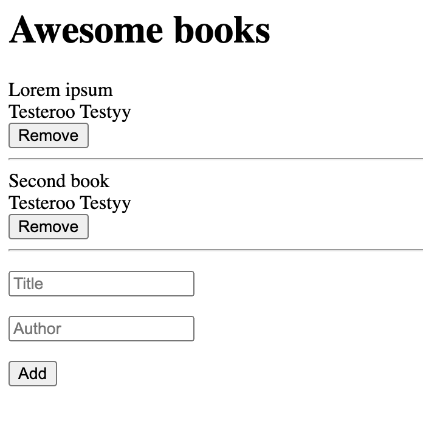
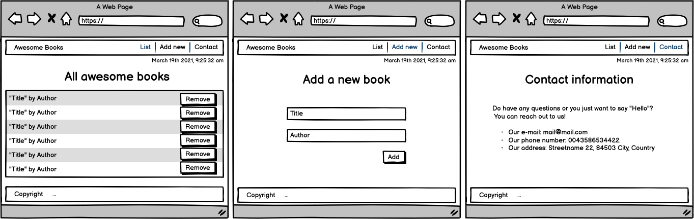

# Yuriy Chamkoriyski and Bogdan Stojanovic Microverse Awesome Books project

> First Javascript project from Module 2 at Microverse

In this project, you will build a basic website that allows users to add/remove books from a list. You will achieve that by using JavaScript objects and arrays. You will also need to dynamically modify the DOM and add basic events.

## Implement only a basic UI with plain HTML (step 1):

- [x] Create a collection that keeps a list of books (hint: you can use an array of objects for that).
- [x] Create a function to add a new book to the collection, with title and author.
- [x] Create a function to remove a book from the collection (hint: you can use the array filter() method).
- [x] Display all books saved in the collection in the top part of the page.
- [x] Make sure that when a user clicks the "Add" button:
    - [x] A new book is added to the collection.
    - [x] The new book is displayed in the page.
- [x] Make sure that when a user clicks the "Remove" button:
    - [x] The correct book is removed from the collection.
    - [x] The correct book disappears from the page.
- [x] Make sure that data is preserved in the browser's memory by using localStorage.
- [x] To debug your application, you can use console.log(). Remember to remove debugging code before pushing your code to the remote repository.
- [x] Don't use any library or framework, use only plain JavaScript.
- [x] You need to use pair-programming for this project. We will check to see if both partners submitted code by looking at the commit history for each project. Therefore you need to use only one repository for your pair-programming group.

## Project requirements refactor to use JavaScript classes (step 2):

- [x] Use JavaScript classes instead of objects and arrays.
  - [x] You can use objects and arrays, but do it inside classes.
- [x] Create class methods to add and remove books.
- [x] Maintain all of the original functionality of the application (i.e. no bugs were introduced while refactoring).
- [x] Don't use any library or framework, use only plain JavaScript.
- [x] You need to use pair-programming for this project. We will check to see if both partners submitted code by looking at the commit history for each project. Therefore you need to use only one repository for your pair-programming group.

## Project requirements style core elements (step 3):

- [x] You can use the styles of your choice (colors, fonts, backgrounds, etc.), but try to follow the general layout.
- [x] Concentrate on the general layout, rather than the details.
- [x] You can use plain CSS or a CSS framework (like Bootstrap) if you prefer.
- [x] You need to use pair-programming for this project. We will check to see if both partners submitted code by looking at the commit history for each project. Therefore you need to use only one repository for your pair-programming group.

## Project requirements a complete website with navigation (step 4):
- [x] Modify the Awesome books application to have:
  - [x] A Navigation bar.
  - [x] Three content sections:
    - [x] a. Books list.
    - [x] b. Add book form.
    - [x] c. Contact info.
- [x] Use this wireframe as a guide:

- Make sure that when you click on any of the links, the main area changes to display only one of the three content sections. (Hint: you can simply add and remove CSS classes to display or hide the content.)
- To change the contents of the page, don't use any library or framework, use only plain JavaScript and CSS.
- Display the current date below the navigation bar. For this requirement you should use a library - [Luxon](https://moment.github.io/luxon/#/install).
  - See the article [Get the current date and time](https://moment.github.io/luxon/#/tour?id=get-the-current-date-and-time).
- You need to use pair-programming for this project. We will check to see if both partners submitted code by looking at the commit history for each project. Therefore you need to use only one repository for your pair-programming group.

## Built With

- Major languages: HTML, CSS, JS
- Frameworks: none
- Technologies used: Git, Luxon

## Live Demo

[Live Demo Link](https://hombre2014.github.io/Awesome_Books/)

## Getting Started

**Simply open the link above.**

To get a local copy up and running follow these simple example steps.

### Prerequisites

- Internet connection and browser

### Setup

N/A

### Install

N/A

### Usage

Make sure you have a clean localstorage before you open the page.
You can clean your localstorage from your browser console using: `localStorage.clear();`

### Run tests

Tested with lighthouse, webhint, stylelint and ESlint.

### Deployment

Just open the live demo link in your browser.

## Author

👤 **Yuriy Chamkoriyski**

- GitHub: [@Hombre2014](https://github.com/Hombre2014)
- Twitter: [@Chamkoriyski](https://twitter.com/Chamkoriyski)
- LinkedIn: [axebit](https://linkedin.com/in/axebit)

👤 **Bogdan Stojanovic**

- GitHub:https://github.com/kakarrot92
- Twitter:https://twitter.com/kakarrot1992
- LinkedIn:https://www.linkedin.com/in/bogdan-stojanovic-97829b136/

## 🤝 Contributing

Contributions, issues, and feature requests are welcome!

Feel free to check the [issues page](https://github.com/Hombre2014/Awesome_Books/issues).

## Show your support

Give a ⭐️ if you like this project!

## Acknowledgments

## 📝 License

This project is [MIT](./MIT.md) licensed.
